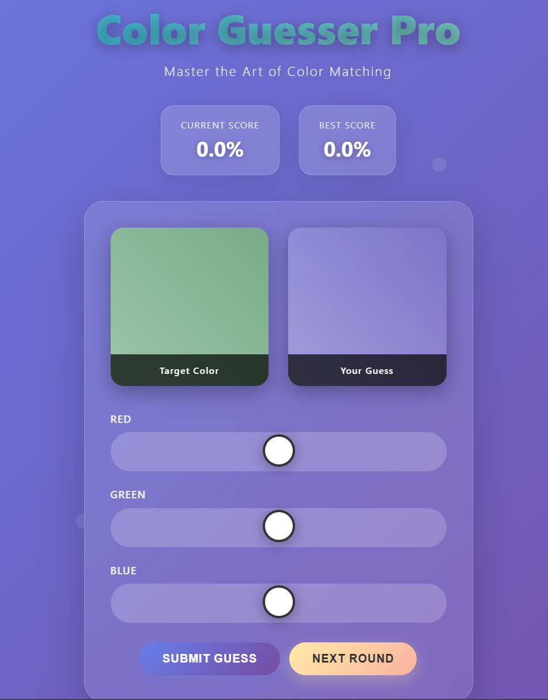

# Color Guesser Pro 🌈🎨


[](https://opensource.org/licenses/MIT)
[](https://github.com/MojtabaFotohi)
[](https://developer.mozilla.org/en-US/docs/Web/HTML)
[](https://developer.mozilla.org/en-US/docs/Web/CSS)
[](https://developer.mozilla.org/en-US/docs/Web/JavaScript)

---

## 🚀 About the Project
Color Guesser Pro is an interactive web-based game where you test your color perception skills! 🎯  
- A random RGB color is generated as the **target**.  
- Use sliders to mix your own RGB values and try to match it as closely as possible.  
- Submit your guess to see your accuracy score, and beat your high score!  

Perfect for designers, artists, or anyone who loves a challenge. No frameworks needed – just vanilla web tech! 💻  




## Watch the game here https://mojtabafotohi.github.io/Color-Guesser-Pro-Game/

---

## ✨ Features
- **Random Color Generation**: Every round brings a new challenge! 🔄  
- **RGB Sliders**: Intuitive controls with gradient tracks for Red 🌹, Green 🌿, and Blue 🌊.  
- **Accuracy Calculation**: Get precise feedback on how close your guess is (0-100%). 📊  
- **Score Tracking**: Current score and best score saved in local storage. 🏆  
- **Animations & Effects**: Smooth transitions, hover effects, and celebration bounces for new records! 🎉  
- **Responsive Design**: Works great on mobile, tablet, and desktop. 📱💻  
- **Dark Mode Friendly**: Stylish gradient background with grain texture for that pro feel. 🌙  

---

## 🛠️ How to Play & Run
1. **Clone the Repo**:  
   ```
   git clone https://github.com/MojtabaFotohi/color-guesser-pro.git
   ```
   
2. **Open the File**: Simply open `index.html` in your favorite browser (Chrome, Firefox, etc.). No server needed! 🚀  

3. **Game Controls**:  
   - Adjust the RGB sliders to match the target color.  
   - Click **Submit Guess** to check your accuracy.  
   - Click **Next Round** for a new color.  

*Pro Tip: Aim for 100% accuracy – it's tougher than it looks! 😎*

---

## 📊 Tech Stack
| Technology | Description | Badge |
|------------|-------------|-------|
| **HTML5** | Structure & Markup |  |
| **CSS3** | Styling, Animations & Responsiveness |  |
| **JavaScript** | Game Logic, Events & Local Storage |  |

No dependencies – pure and lightweight! ⚡  

---

## 🎯 Future Improvements
- Add difficulty levels (e.g., timed rounds ⏱️).  
- Multiplayer mode via WebSockets. 👥  
- Color blind mode with alternative patterns. ♿  
- Share scores on social media. 📤  

Contributions welcome! Fork the repo and submit a PR. 🤝  

---

## 📝 License
This project is licensed under the MIT License - see the [LICENSE](LICENSE) file for details.  

---

*Built with ❤️ by MojtabaFotohi – Star the repo if you enjoy it! ⭐*  

